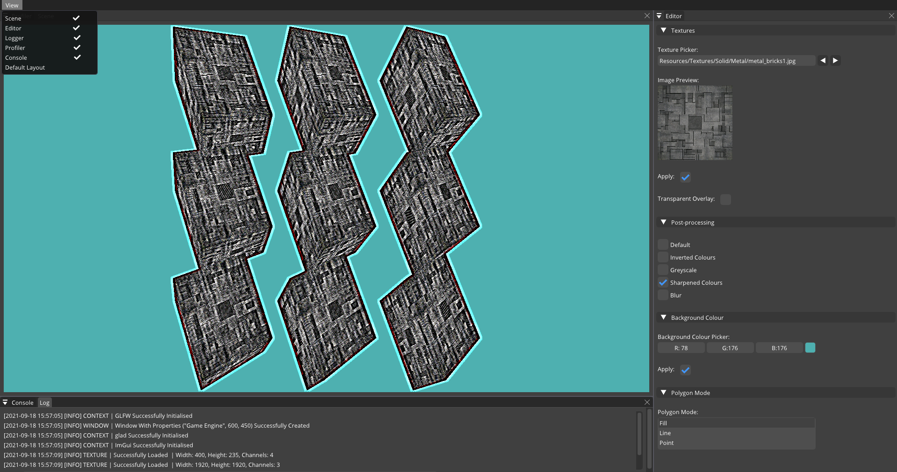
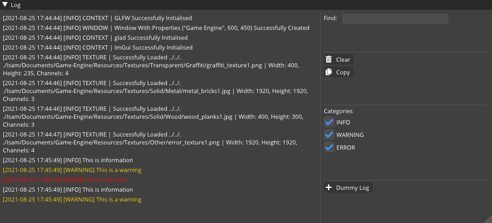
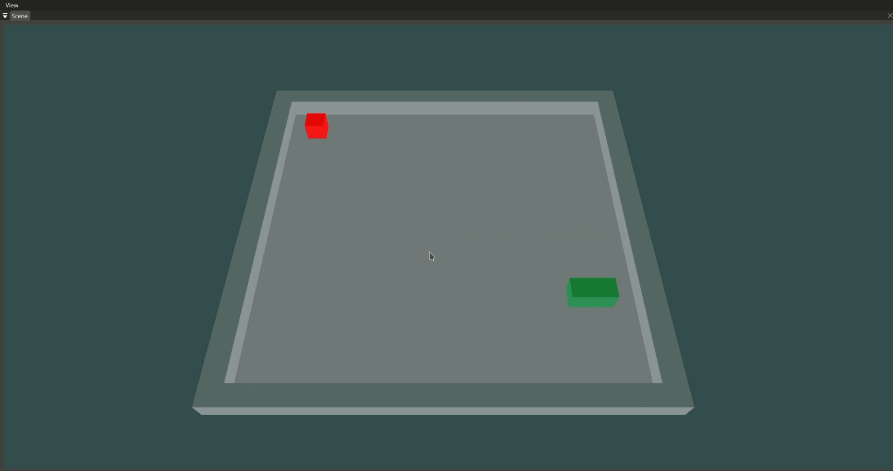

### Editor:

### Logger:

### Demo (3d-snake):

### Features:

- Cross-platform (Windows, Linux)
- Core functionalities (`Core/`)
- Logger
- Keyboard and mouse input handler
- Simple renderer
- Texture loader  
- Shader loader
- 3d camera support
- 3d transformations
- Post-processing effects
- User interface
- Editor
- Default docking

### Usage:

#### Requirements:
- Git
- CMake 3.13
- C++ 17 compiler
- OpenGL 4.5 Support

#### Building:
- Clone the repository
- Generate a build directory with CMake generator
- Build using CMake

[Original repository](https://github.com/Isam-Ilyas29/Game-Engine/)